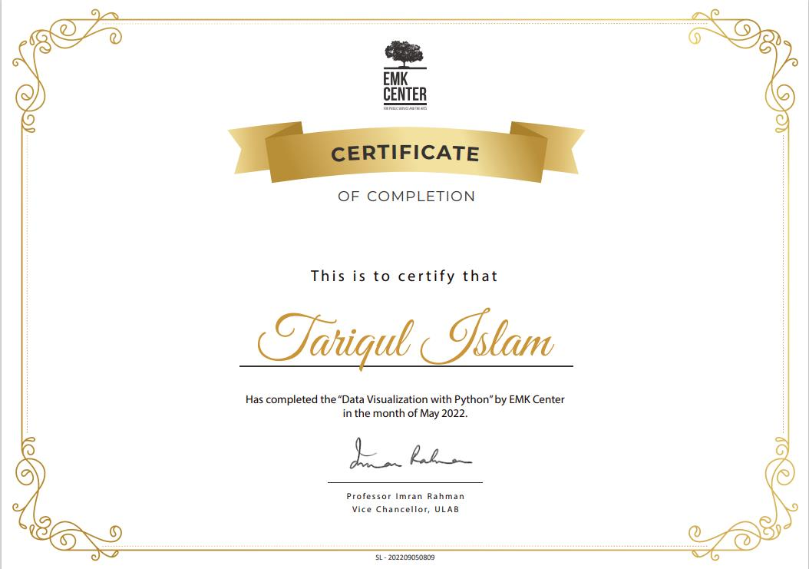

# Data Visualization with Python

# Certificate

# Course Details
- Storytelling with data
- Create rich informative data graphs
- Discover important context to understand data
- Create impactful data visualisztions
- Design effective data communication
- Distinguish between good, bad and wrong visualization
- Advanced customization options like subplots, gridspec, style sheets and parameters
- Mathematics for Python
- Go through a complete loan data case study and apply your NumPy skills
- Create pie, bar, line, area, histogram, scatter, regression, and combo charts
- NumPy and pandas, basics and advanced
- Clean data with pandas Series and DataFrames
- Expand knowledge of NumPy – statistics and preprocessing
- Apply best practices for data visualization, storytelling, formatting and visual design
